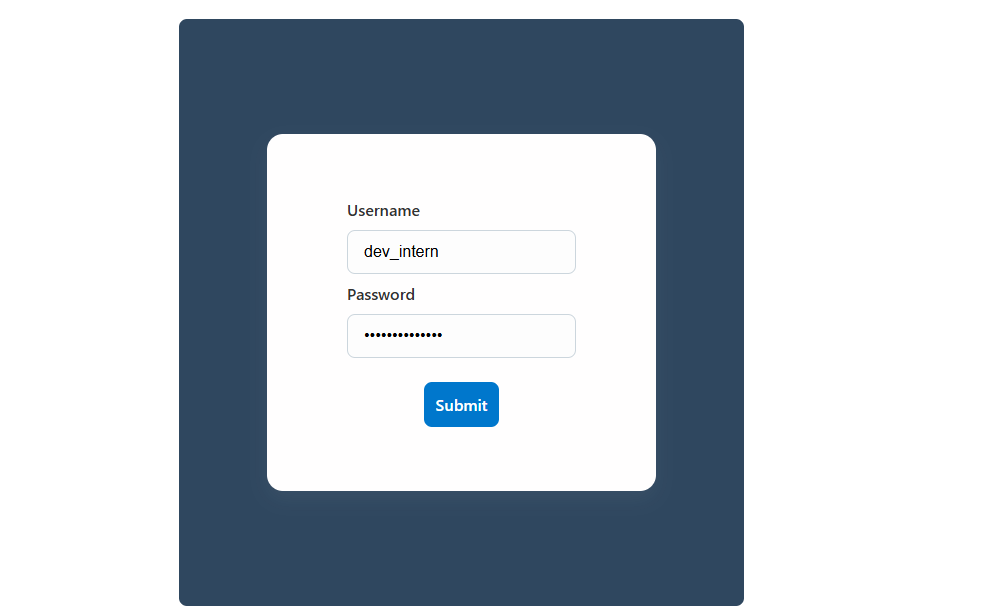
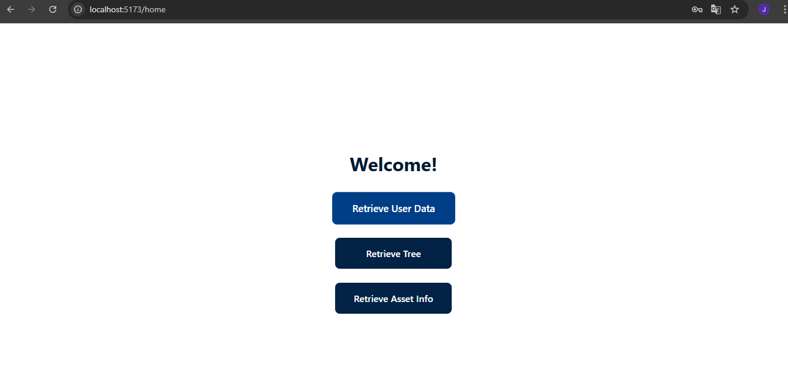
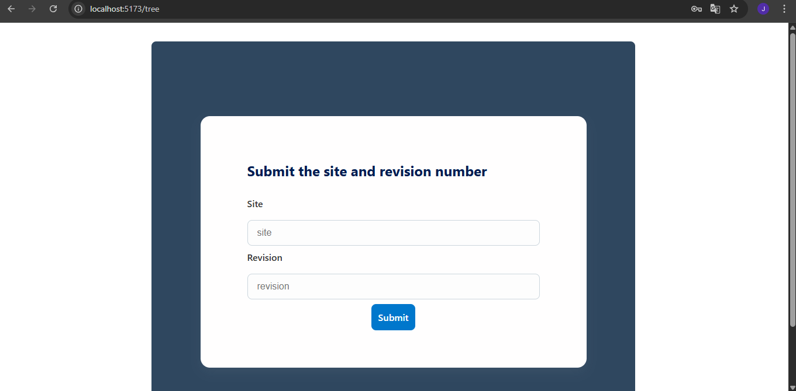
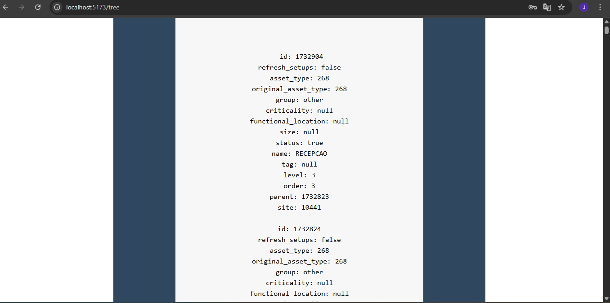
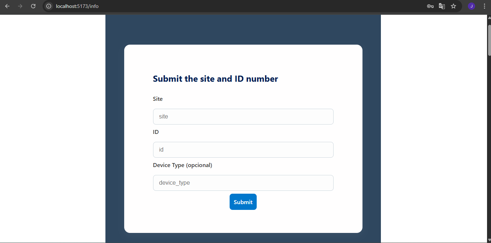
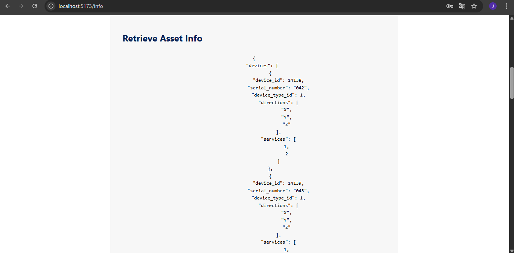

## API Challenge

This is a Proxy API that consumes data from the Portal Stream platform. It uses JWT authentication and performs three authenticated requests to the available resources.

### 📋 Project Overview

This project acts as a middleware between the frontend and the Portal Stream API. Its main purpose is to provide secure access to protected resources, manage authentication, and facilitate data consumption via a simplified API layer.

### 📁 Project Structure

```bash
desafio_proxy_api/
├── app/                 # FastAPI backend
│   ├── main.py          # Main application entry point
│   ├── routes/          # API route definitions
│   └── .env             # Environment variables
├── frontend/            # Frontend application
│   ├── public/          # Static assets
│   ├── src/             # Source code
│   └── package.json     # Frontend dependencies
├── .gitignore           # Git ignore rules
├── LICENSE              # Project license
└── README.md            # Project documentation

```

### ✅ Requirements

To run the project locally, you need to have the following installed:

Python 3.10 or higher

Node.js (LTS version recommended)

npm (comes with Node.js)

## 🔧 Environment Setup

### 1. Clone the Repository

```bash
git clone (https://github.com/julia-soares-semeq/desafio_proxy_api)
cd desafio_proxy_api
```

### 2. Install Dependencies

Backend
🐍 [Python](https://www.python.org/downloads/)

During installation:

- Make sure to check "Add Python to PATH"

- Choose version 3.10+

Install packages fastapi, uvicorn, and httpx:

```bash
pip install "fastapi[standard]"
```

```bash
pip install python-dotenv
```

```bash
pip install httpx 
```

Frontend

🌳 [Node.js](https://nodejs.org/en/download)

Install frontend dependencies:

```bash
cd frontend
npm install
npm install react-router-dom
```

## 🚀 Running the Project

Backend
Start the FastAPI server:

```bash
cd app
uvicorn app.main:app --reload
```

This will run the server at [http://127.0.0.1:8000/]

Frontend
In a separate terminal window, run the frontend:

```bash
cd desafio_proxy_api/frontend
npm run dev
```

This will start the frontend development server on [http://localhost:5173/](http://localhost:5173/).

## 🔐 How the Application Works

### 🔑 Authentication

When you first access the application, you should navigate to the root /login where you’ll be prompted to log in.
The frontend presents a login form where you must enter your username and password, then submit the form.



### 🏠 Home Page & Actions

After logging in, you will be redirected to the home page.
Here, you’ll find three buttons that allow you to:

- Fetch usercorp data

- Retrieve the tree structure

- Get asset information



### 🌳 Retrieve Tree Data

To retrieve tree data, fill in the site and revision inputs, then submit.



The results will be displayed below the form.



### 🏷️ Retrieve Asset Info

To retrieve asset information, enter the site and asset ID.



Optionally, you may provide a device type, though it is not required.


